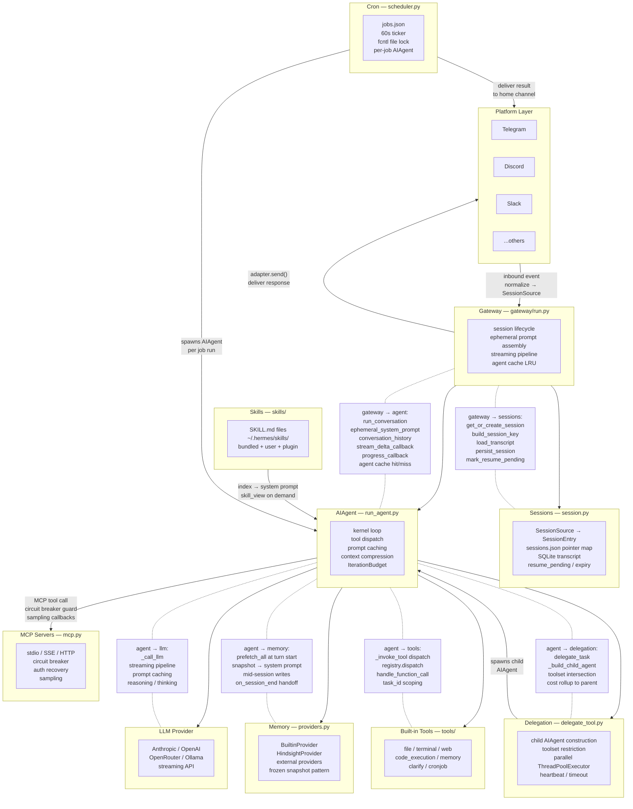

```mermaid
flowchart TB
    subgraph PL["Platform Layer"]
        TG["Telegram"]
        DC["Discord"]
        SL["Slack"]
        OT["...others"]
    end

    subgraph GW["Gateway — gateway/run.py"]
        GW_CORE["session lifecycle\nephemeral prompt assembly\nstreaming pipeline\nagent cache LRU"]
    end

    subgraph SESS["Sessions — session.py"]
        SESS_CORE["SessionSource → SessionEntry\nsessions.json pointer map\nSQLite transcript\nresume_pending / expiry"]
    end

    subgraph AG["AIAgent — run_agent.py"]
        AG_CORE["kernel loop\ntool dispatch\nprompt caching\ncontext compression\nIterationBudget"]
    end

    subgraph LLM["LLM Provider"]
        LLM_CORE["Anthropic / OpenAI\nOpenRouter / Ollama\nstreaming API"]
    end

    subgraph MEM["Memory — providers.py"]
        MEM_CORE["BuiltinProvider\nHindsightProvider\nexternal providers\nfrozen snapshot pattern"]
    end

    subgraph SK["Skills — skills/"]
        SK_CORE["SKILL.md files\n~/.hermes/skills/\nbundled + user + plugin"]
    end

    subgraph TOOLS["Built-in Tools — tools/"]
        TOOLS_CORE["file / terminal / web\ncode_execution / memory\nclarify / cronjob"]
    end

    subgraph MCP["MCP Servers — mcp.py"]
        MCP_CORE["stdio / SSE / HTTP\ncircuit breaker\nauth recovery\nsampling"]
    end

    subgraph DEL["Delegation — delegate_tool.py"]
        DEL_CORE["child AIAgent construction\ntoolset restriction\nparallel ThreadPoolExecutor\nheartbeat / timeout"]
    end

    subgraph CRON["Cron — scheduler.py"]
        CRON_CORE["jobs.json\n60s ticker\nfcntl file lock\nper-job AIAgent"]
    end

    PL -->|"inbound event\nnormalize → SessionSource"| GW
    GW -->|"adapter.send()\ndeliver response"| PL

    GW --> SESS
    GW -.- GW_SESS["gateway → sessions:\nget_or_create_session\nbuild_session_key\nload_transcript\npersist_session\nmark_resume_pending"]
    GW_SESS -.- SESS

    GW --> AG
    GW -.- GW_AG["gateway → agent:\nrun_conversation\nephemeral_system_prompt\nconversation_history\nstream_delta_callback\nprogress_callback\nagent cache hit/miss"]
    GW_AG -.- AG

    AG --> LLM
    AG -.- AG_LLM["agent → llm:\n_call_llm\nstreaming pipeline\nprompt caching\nreasoning / thinking"]
    AG_LLM -.- LLM

    AG --> MEM
    AG -.- AG_MEM["agent → memory:\nprefetch_all at turn start\nsnapshot → system prompt\nmid-session writes\non_session_end handoff"]
    AG_MEM -.- MEM

    SK -->|"index → system prompt\nskill_view on demand"| AG

    AG --> TOOLS
    AG -.- AG_TOOLS["agent → tools:\n_invoke_tool dispatch\nregistry.dispatch\nhandle_function_call\ntask_id scoping"]
    AG_TOOLS -.- TOOLS

    AG -->|"MCP tool call\ncircuit breaker guard\nsampling callbacks"| MCP

    AG --> DEL
    AG -.- AG_DEL["agent → delegation:\ndelegate_task\n_build_child_agent\ntoolset intersection\ncost rollup to parent"]
    AG_DEL -.- DEL

    DEL -->|"spawns child\nAIAgent"| AG

    CRON -->|"spawns AIAgent\nper job run"| AG
    CRON -->|"deliver result\nto home channel"| PL
```
